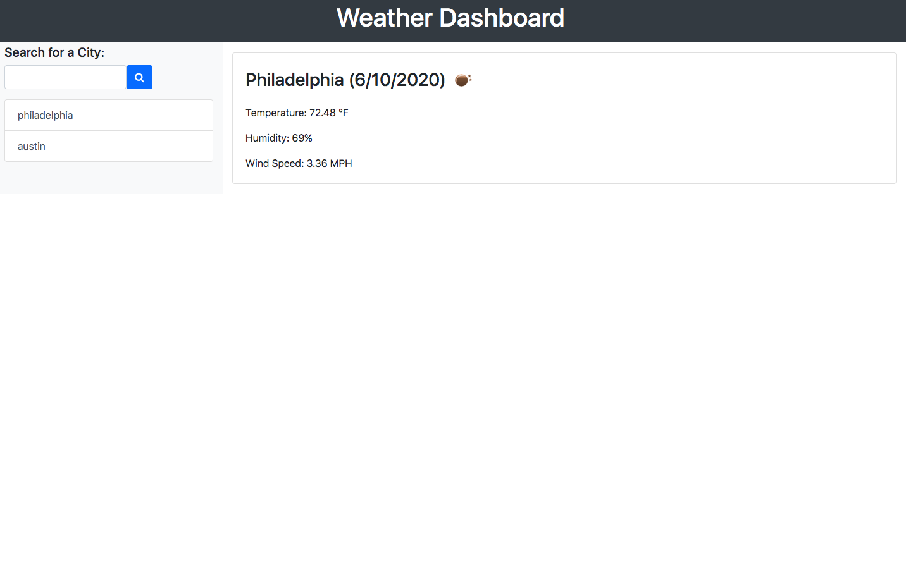
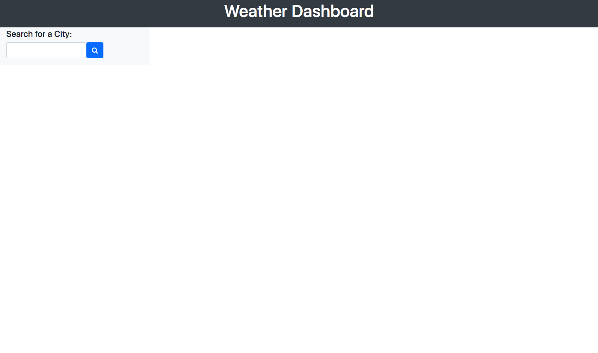
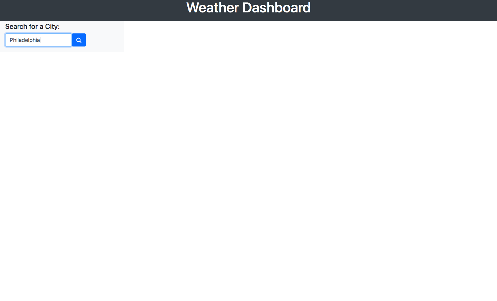

# Weather Dashboard

 

## Description

This weather Application shows the current forecast in a selected city. The current date and weather Icon will be displayed depending on the current weather and the current  temperature, humidty, and wind speed will be displayed.

 ## Click [here](https://brianlevin.github.io/Weather-Dashboard/) for the live app. 
 
 Here is the homepage:
 
 
 
 Type in city in the search bar:
 
 
 The current weather for the selected will be displayed:
 
 
 Multiple cities can be selected:
  
 
## Libraries and frameworks:
- Html
- Css
- Javascript
- Jquery
- Moment JS
- API Key

